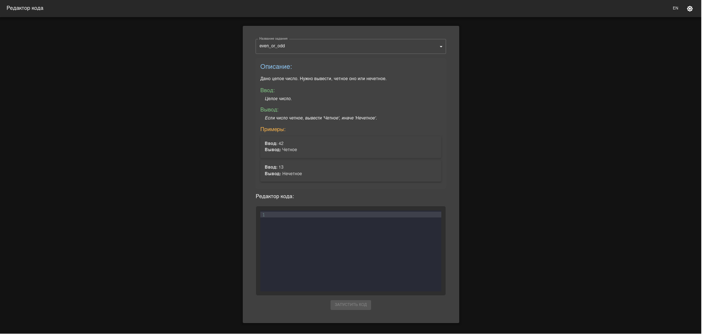
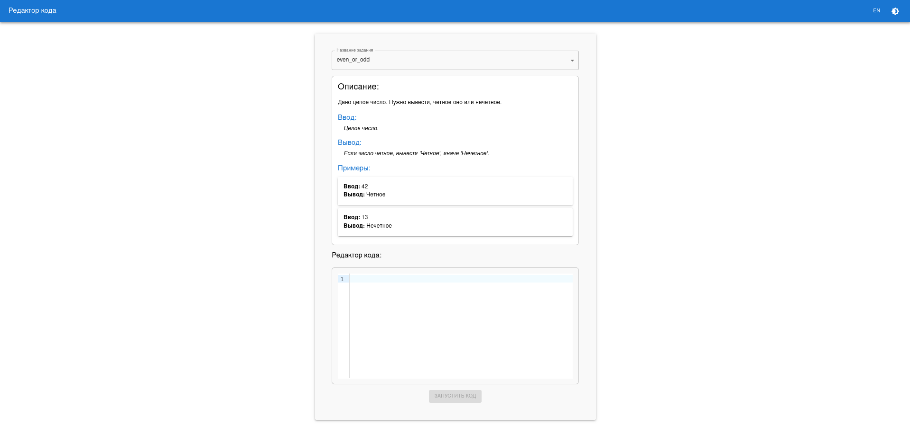
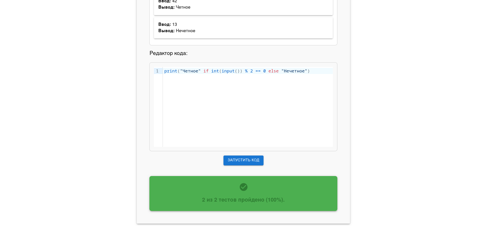
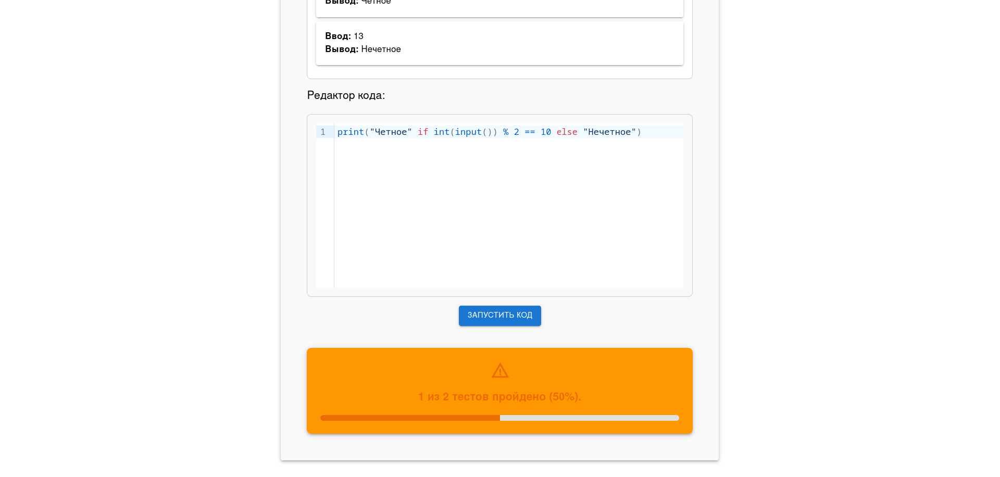

# ProgLearningGround

**ProgLearningGround** is a platform designed to help people learn programming and solve coding challenges.

---

## Start project

1. Create .env file using example from .env.template

2. You can start the project with docker:

```bash
docker compose up --build
```

---

## Technologies

- MongoDB: A database management system used to store data.
- Docker: Containerization tool for easy deployment and development.
- FastAPI: A modern and fast web framework for building APIs in Python.
- React: A library for building user interfaces, used in the frontend.

---

## Tools and Linters Used in the Project

This project adheres to best practices for code quality, testing, and static analysis. Below is a list of the tools and
linters integrated into the development process:

### 1. **[Ruff](https://github.com/astral-sh/ruff)**

- Configured through `ruff.toml`.

### 2. **[Black](https://github.com/psf/black)**

### 3. **[Mypy](https://github.com/python/mypy)**

- Configured through `mypy.ini`.

### 4. **[Pytest](https://docs.pytest.org/)**

---

## Pre-commit Hooks

To maintain code quality and consistency, **pre-commit** hooks are configured to automatically run the above tools
before committing code to the repository.

### Tools Configured in Pre-commit:

- **Ruff**: Lints the codebase.
- **Black**: Formats the code.
- **Mypy**: Performs static type checks.
- **Pytest**: Runs the test suite.

## Application Screenshot

Here is a screenshot of the main page (dark theme):

Screenshot of the main page (light theme):

Correctly passed tests:

Incorrectly passed tests:
